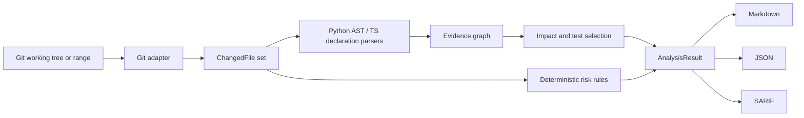

# Architecture

PatchSignal is a small hexagonal pipeline. The domain models in `patchsignal.models` describe the stable vocabulary: changed files, symbols, relations, impact items, and risk signals. The Git adapter is the only component that invokes Git. Language parsers are syntax-only adapters. The engine combines evidence into a result, while renderers translate that result into stable output formats.

## Data flow

## Why syntax-only parsing

Executing a target repository would make analysis unsafe and non-reproducible. Python `ast` gives useful symbol and import evidence without importing modules. The TypeScript adapter intentionally supports common declarations and imports with a small dependency-free parser; it is conservative and should report missing coverage rather than pretending to understand every language construct.

## Impact semantics

An impact item is evidence, not a proof of runtime reachability. A directly changed file receives a higher score than a filename/module relationship. Candidate tests are recommendations, not permission to skip the rest of a project's suite. Future resolvers can add richer evidence without changing the output contract.

## Extension points

A language adapter should return `Symbol` and `Relation` values. An evidence provider may add relations from a lockfile, test manifest, or historical co-change index. A renderer should consume `AnalysisResult` and preserve machine-readable fields. New public fields should be additive and covered by contract tests.

## Threat model

The repository under analysis is untrusted. PatchSignal must not evaluate source, follow URLs, interpolate Git arguments into a shell, or write outside an explicitly requested output path. A malformed file is skipped with conservative coverage rather than executed. Future network integrations must be opt-in and isolated from the default local pipeline.
